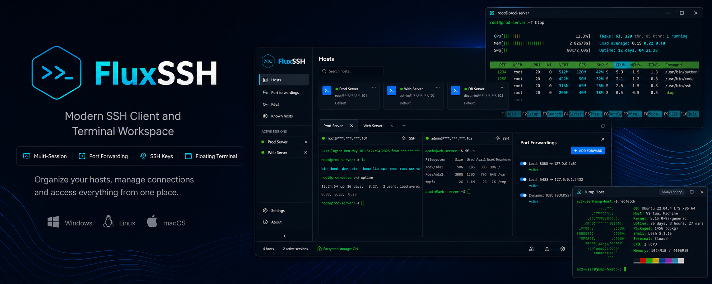
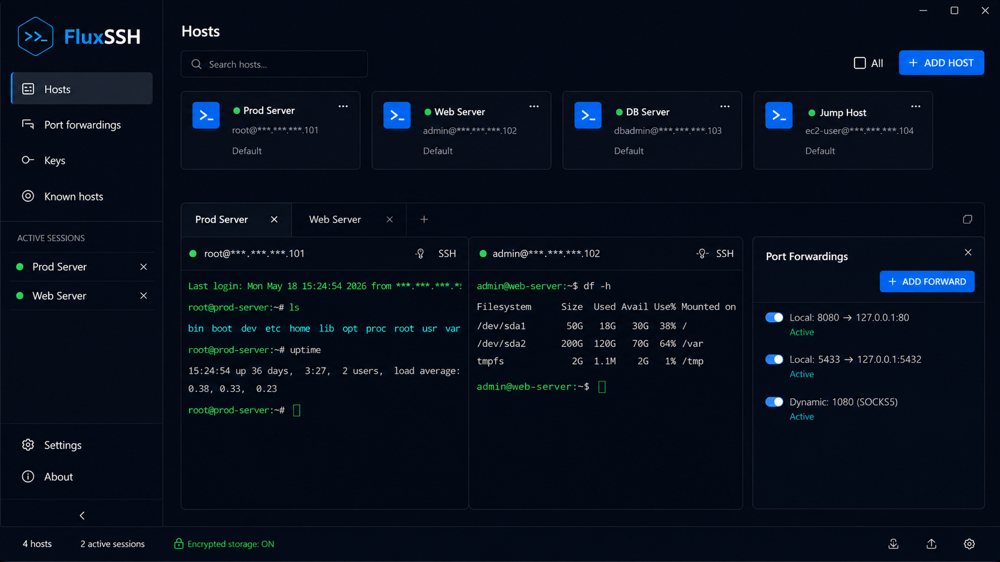
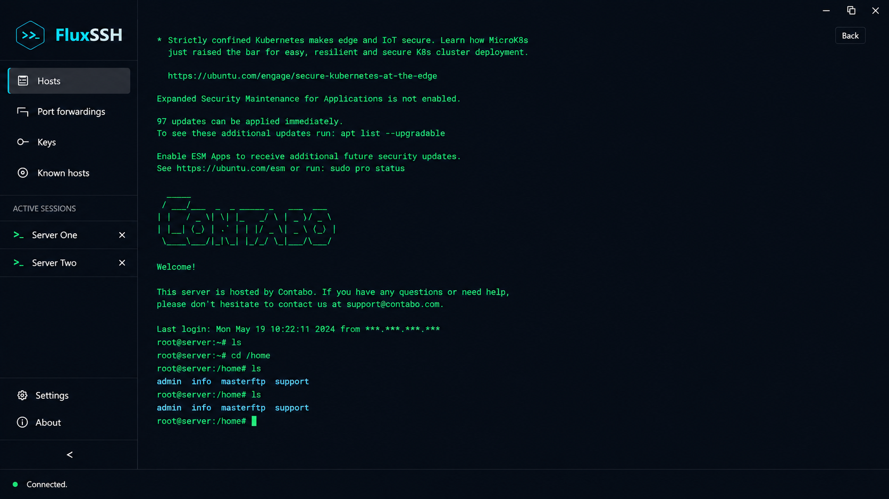
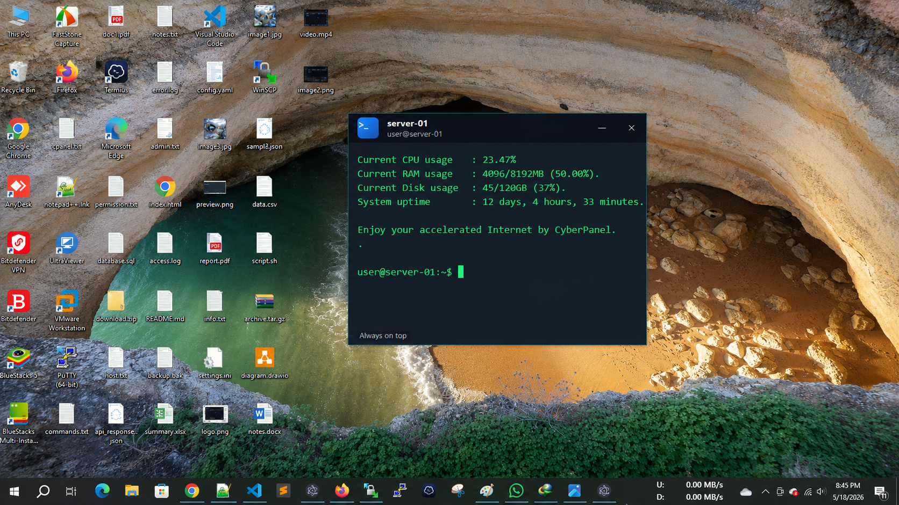

  

<h1 align="center">FluxSSH</h1>

Modern SSH client and terminal workspace built for developers.

  
  
  

---

# ✨ Features

## 🖥 Host Management
- Saved host profiles
- Fast host search
- Sidebar active session list
- Multiple SSH sessions
- Reconnect support
- Host cards with quick connection

## 💻 Terminal Workspace
- Split terminal workspace
- Fullscreen terminal mode
- Switch active SSH while fullscreen
- Floating always-on-top terminal window
- Draggable & resizable floating terminal
- Works while main app is minimized
- Terminal copy & paste
- Terminal themes
- Font size / line height / cursor customization

## 🔐 Security
- Password login support
- Private key login support
- SSH key vault
- Encrypted local storage
- Known hosts verification
- Fingerprint verification

## 🌐 Networking
- Port forwarding panel
- Local forwarding
- Remote forwarding
- Dynamic SOCKS forwarding

## 💾 Backup System
- Import/export backup
- Export hosts, keys, forwards & settings

## ⚡ Productivity
- Auto reconnect
- Clean dark modern UI
- Fast lightweight performance

---

# 📸 Screenshots

## Host Manager & Dashboard

  

---

## Fullscreen Terminal Workspace

  

---

## Floating Terminal Window

  

---

# 📥 Download

Download the latest release here:

👉 https://github.com/mostafijar/FluxSSH/releases/

---

# 🛠 Installation

## Windows
Download the `.exe` installer from the releases page.

# 🛠 Installation

## Windows
Download the `.exe` installer from the releases page.

## Linux
Download one of these packages from Releases:

- `.AppImage` → Portable version (recommended)
- `.deb` → Ubuntu / Debian
- `.rpm` → Fedora / CentOS / RHEL

## macOS
Coming soon.

---

# 🚀 Why FluxSSH?

FluxSSH is designed for developers, sysadmins, DevOps engineers, and power users who need a modern SSH workspace with:

- Fast workflow
- Multi-session management
- Floating terminals
- Secure key storage
- Advanced forwarding
- Beautiful dark UI
- Developer-focused experience

---

# 🔒 Security

FluxSSH stores sensitive information securely using encrypted local storage.

Supported:
- Password authentication
- SSH private keys
- Fingerprint verification
- Known hosts validation

---

---

# ⭐ Support The Project

If you like FluxSSH, please consider giving it a ⭐ on GitHub.

It helps the project grow and motivates future updates.

---

# 📄 License

MIT License

---

Made with ❤️ for developers

